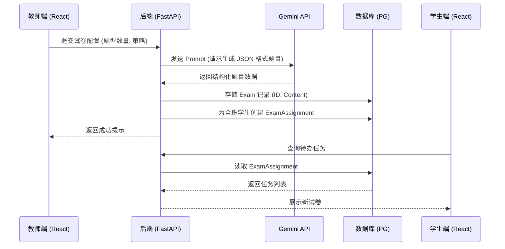
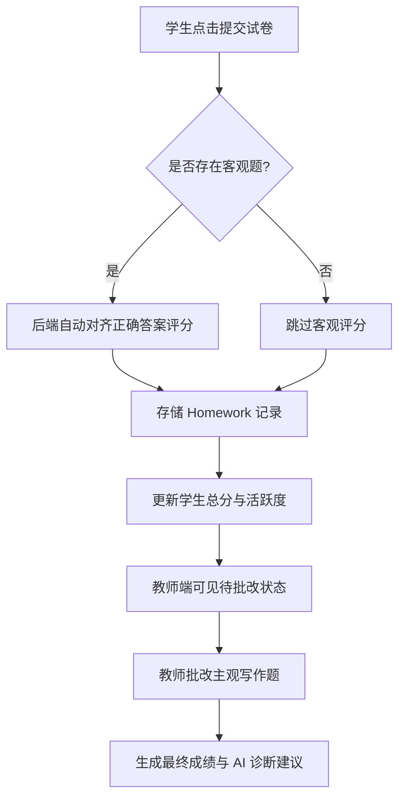
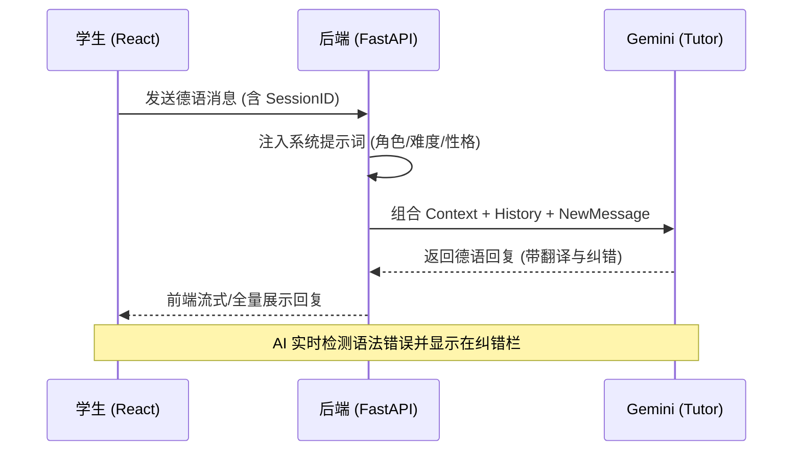
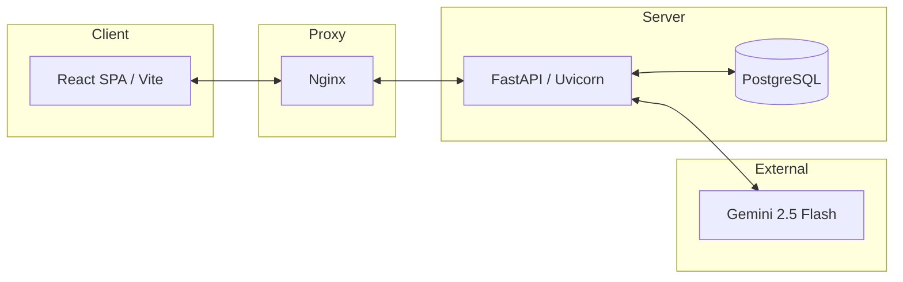

# SITP German AI Agent 系统流程与架构

本模块通过 Mermaid 图表展示系统的核心业务流程与架构设计，帮助开发者快速理解系统逻辑。

---

## 1. 核心业务流程 (Core Workflows)

### 1.1 试卷生成与分发流程 (Exam Generation & Distribution)



### 1.2 考试提交与评分流程 (Exam Submission & Scoring)



### 1.3 AI 情景对话交互流程 (AI Scenario Chat)



---

## 2. 数据关系简图 (ER-Lite)

```mermaid
erDiagram
    USER ||--o| TEACHER : is
    USER ||--o| STUDENT : is
    CLASS ||--o{ STUDENT : contains
    CLASS ||--|| TEACHER : managed_by
    EXAM ||--o{ EXAM_ASSIGNMENT : templates
    STUDENT ||--o{ EXAM_ASSIGNMENT : receives
    EXAM_ASSIGNMENT ||--o| HOMEWORK : triggers
    HOMEWORK ||--o{ HOMEWORK_REVIEW : reviewed_by
    SCENARIO ||--o{ SCENARIO_PUSH : templates
    STUDENT ||--o{ SCENARIO_PUSH : receives
```

---

## 3. 技术组件拓扑 (Component Topology)


