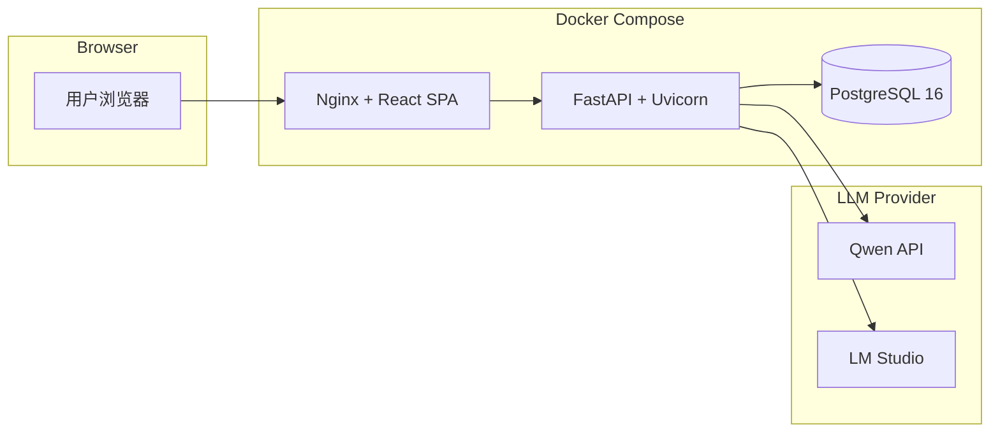
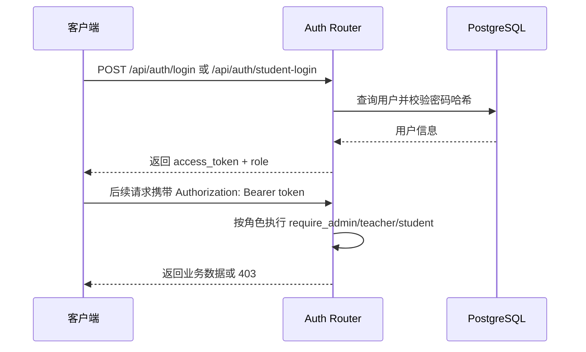
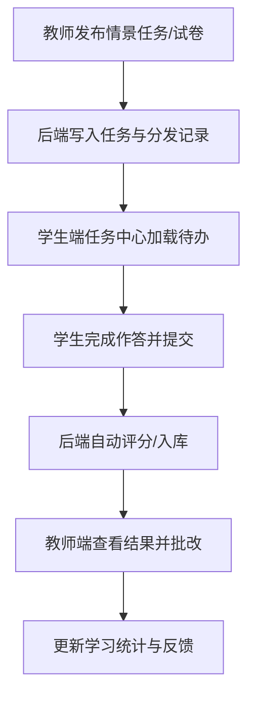
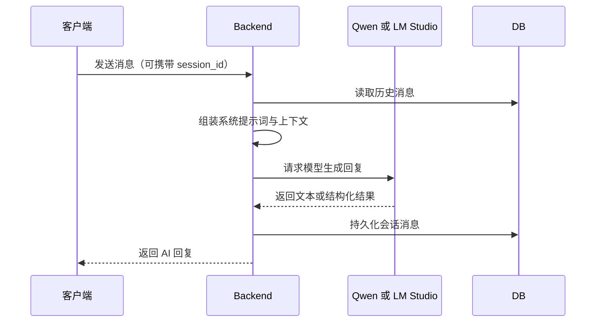
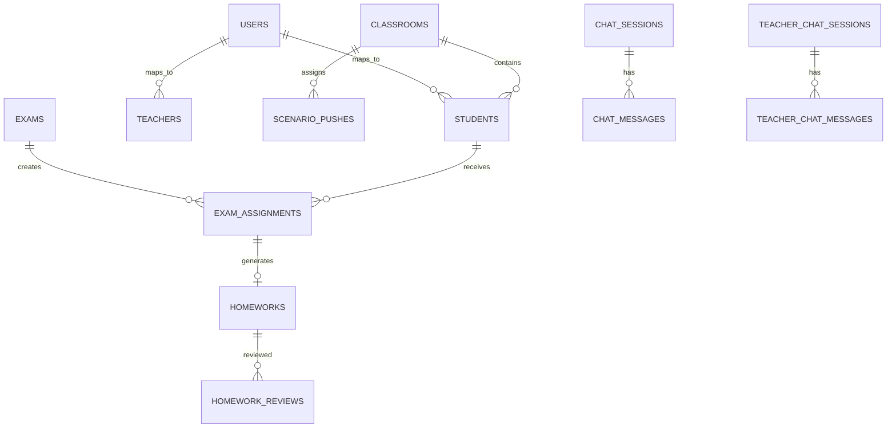
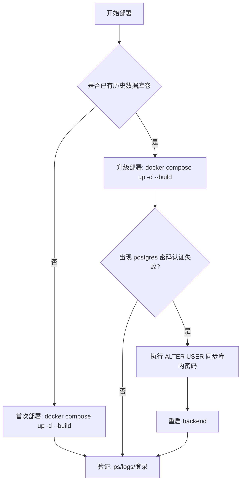
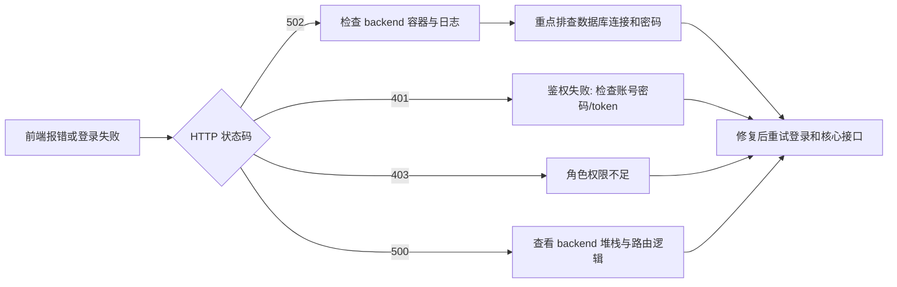

# SITP German AI Agent 系统流程与架构

本文通过流程图和组件图解释系统在教学业务、AI 调用、部署运维三个维度的工作方式。

---

## 1. 总体架构

说明：

- 外部流量统一进入前端 Nginx，再转发至后端 /api。
- 后端通过环境变量切换 Qwen 或 LM Studio。
- 数据库持久化在 Docker 卷中，升级部署时默认保留。

---

## 2. 认证与鉴权流程

---

## 3. 教学主流程

### 3.1 教师发布任务与学生作答

### 3.2 AI 对话流程（教师/学生通用）

---

## 4. 数据关系（ER-Lite）

---

## 5. 部署流程分支

---

## 6. 故障定位路径

---

## 7. 架构演进建议

1. 把高频业务补齐自动化测试用例，降低回归风险。
2. 引入结构化日志与追踪 ID，缩短线上故障定位时间。
3. 逐步收敛数据库启动补丁到迁移脚本，降低运行时复杂度。
4. 为 AI 调用增加限流、超时与降级策略，提升高并发稳定性。
